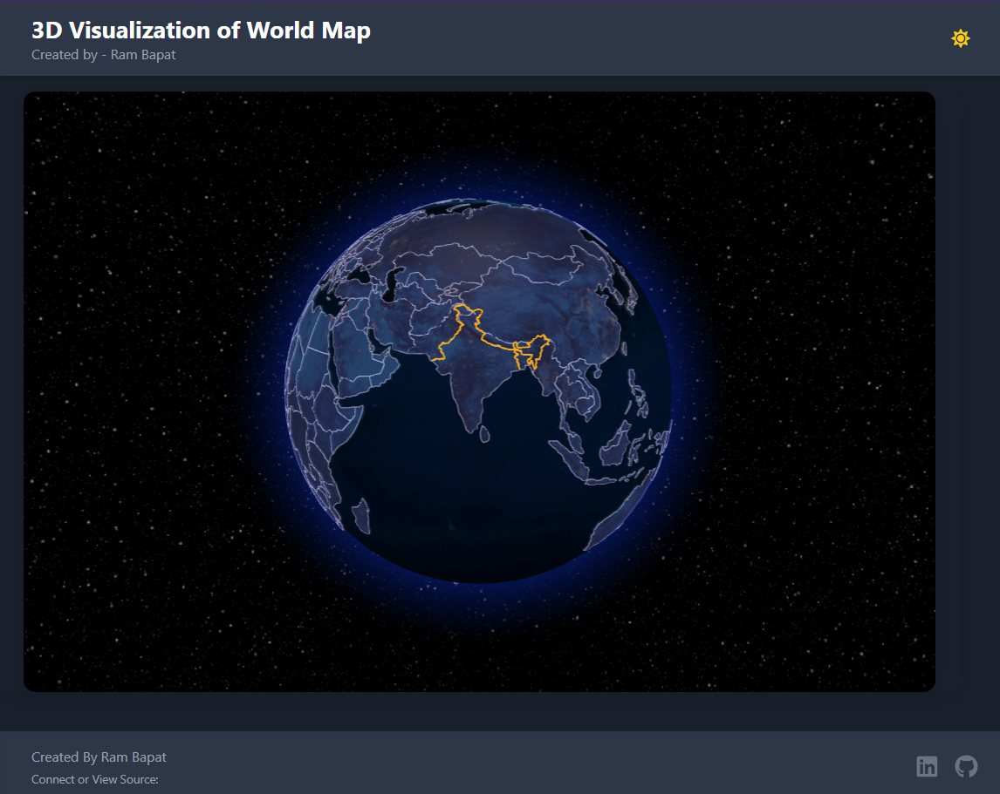
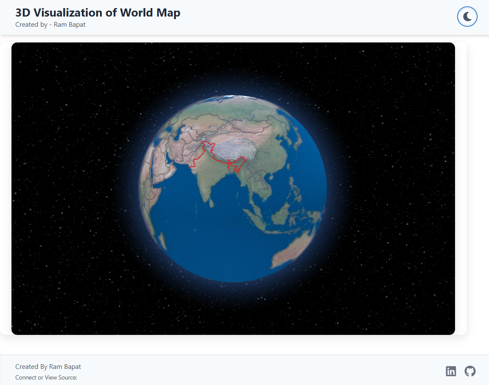
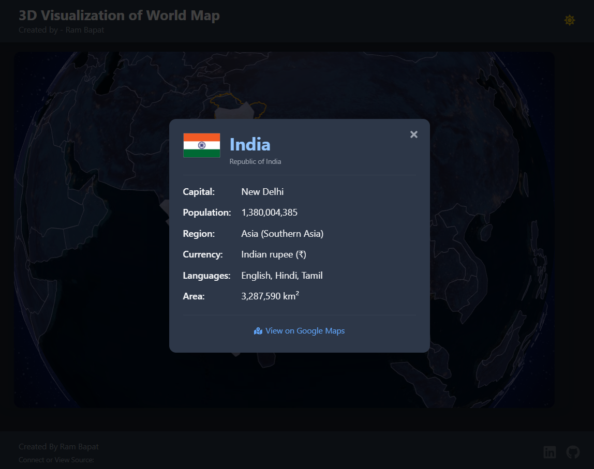

# 3D World Map Visualization (React) ✨🌍🌓

## Try live demo - [Demo](https://3d-globe.vercel.app/)

A visually stunning and interactive 3D world map application built with React, Vite, and Tailwind CSS. Explore countries, view information on click, and toggle between dark and light themes. Developed as part of the #30DaysOfVibeCoding challenge with AI assistance.

<!-- ================================================== -->





<!-- ================================================== -->

## Overview

This project presents an interactive 3D globe displaying countries of the world. Users can:

*   Rotate and zoom the globe.
*   See countries highlight when hovered over.
*   Click on a country to view a detailed information card (fetching data from a local JSON derived from the REST Countries API).
*   Toggle between a default dark theme and a light theme.
*   Experience a responsive interface designed for desktop, tablet, and mobile.

A key feature implemented is the specific handling of India's boundaries. Using custom line data and Turf.js for point-in-polygon checks, clicks within the user-defined boundary for India prioritize displaying India's information, attempting to align with specific representational requirements.

The development heavily utilized AI assistance ("Vibe Coding") for generating components, suggesting libraries, debugging CSS and logic, and refining features, aligning with the goals of the #30DaysOfVibeCoding challenge.

## Features

*   **Interactive 3D Globe:** Smooth rendering and interaction using `react-globe.gl`.
*   **Country Highlighting:** Visual feedback on hover.
*   **Detailed Info Popup:** Displays country details (flag, capital, population, region, etc.) on click.
*   **Dark/Light Theme Toggle:** Class-based theme switching with smooth transitions and persistence via `localStorage`.
*   **Custom Boundary Handling (India):** Uses `pathsData` to render a specific boundary outline for India and `onGlobeClick` with Turf.js point-in-polygon testing to prioritize clicks within this boundary.
*   **Responsive Design:** Adapts layout and map size across different screen resolutions.
*   **Data-Driven:**
    *   Base map polygons loaded from Natural Earth GeoJSON.
    *   Detailed country information loaded from a local JSON file (`countryInfo.json` - originally sourced from REST Countries).
    *   Custom India boundary line loaded from a local GeoJSON file (`indiaBoundary.json`). (Credit [@thejeshgn](https://github.com/datameet/maps))
*   **Modern Tech Stack:** Built with React, Vite, and Tailwind CSS.
*   **Iconography:** Utilizes `react-icons` for UI elements.

## Tech Stack

*   **Frontend:** React 18+
*   **Build Tool:** Vite
*   **Styling:** Tailwind CSS (with PostCSS)
*   **3D Globe:** `react-globe.gl` (which uses `three.js`)
*   **Geospatial Checks:** `@turf/turf`
*   **Language:** JavaScript (ES6+)
*   **Icons:** `react-icons`
*   **Package Manager:** npm

## Getting Started

To get a local copy up and running, follow these simple steps.

### Prerequisites

*   Node.js (v18 or later recommended) which includes npm: [nodejs.org](https://nodejs.org/)
*   Git (for cloning): [git-scm.com](https://git-scm.com/)

### Installation & Setup

1.  **Clone the repository:**
    ```bash
    git clone https://github.com/Barrsum/3D-Globe.git
    ```

2.  **Navigate to the project directory:**
    ```bash
    cd 3D-Globe
    ```

3.  **Install NPM packages:**
    ```bash
    npm install
    ```
    *(This will install React, Vite, Tailwind, react-globe.gl, three, react-icons, @turf/turf, and other dependencies)*

### Running the Project

1.  **Start the development server:**
    ```bash
    npm run dev
    ```
    This command will start the Vite development server, typically watching for changes.

2.  **Open the application:**
    Open your web browser and navigate to the local URL provided by Vite (usually `http://localhost:5173/`).

## Contributing

Contributions, issues, and feature requests are welcome! Feel free to check the [issues page](https://github.com/Barrsum/3D-Globe/issues).

1.  Fork the Project
2.  Create your Feature Branch (`git checkout -b feature/AmazingFeature`)
3.  Commit your Changes (`git commit -m 'Add some AmazingFeature'`)
4.  Push to the Branch (`git push origin feature/AmazingFeature`)
5.  Open a Pull Request

## License

Distributed under the MIT License. See `LICENSE.md`.

## Acknowledgements

*   **Globe Library:** [react-globe.gl](https://github.com/vasturiano/react-globe.gl) by Vasco Asturiano
*   **3D Engine:** [three.js](https://threejs.org/)
*   **World Polygons:** [Natural Earth Data](https://www.naturalearthdata.com/) (via react-globe.gl examples)
*   **Country Details Data:** Sourced originally from [REST Countries API](https://restcountries.com/) (stored locally)
*   **India Boundary Data:** [@thejeshgn](https://github.com/datameet/maps.git) for custom GeoJSON `LineString`.
*   **Point-in-Polygon Library:** [Turf.js](https://turfjs.org/)
*   **Icons:** [React Icons](https://react-icons.github.io/react-icons/)
*   **Framework & Build Tool:** [React](https://react.dev/), [Vite](https://vitejs.dev/)
*   **Styling:** [Tailwind CSS](https://tailwindcss.com/)

---

Built by Ram Bapat as part of the **#30DaysOfVibeCoding** Challenge! 🚀
*   Challenge Post: [LinkedIn](https://www.linkedin.com/posts/ram-bapat-barrsum-diamos_vibecoding-ai-machinelearning-activity-7312839191153860608-wQ8y?utm_source=share&utm_medium=member_desktop)
*   Connect with me: [LinkedIn Profile](https://www.linkedin.com/in/ram-bapat-barrsum-diamos)